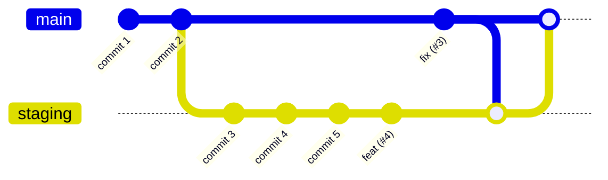
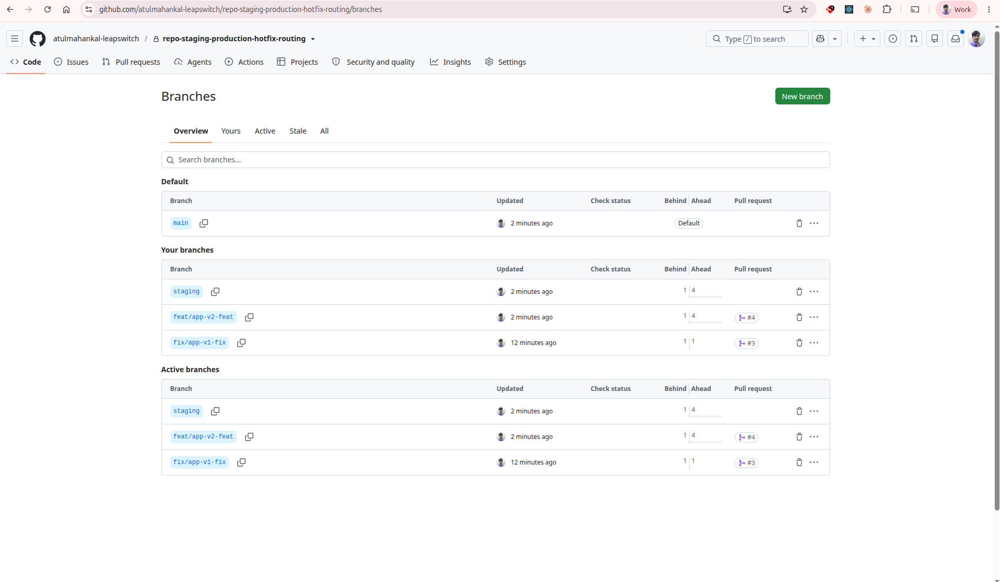
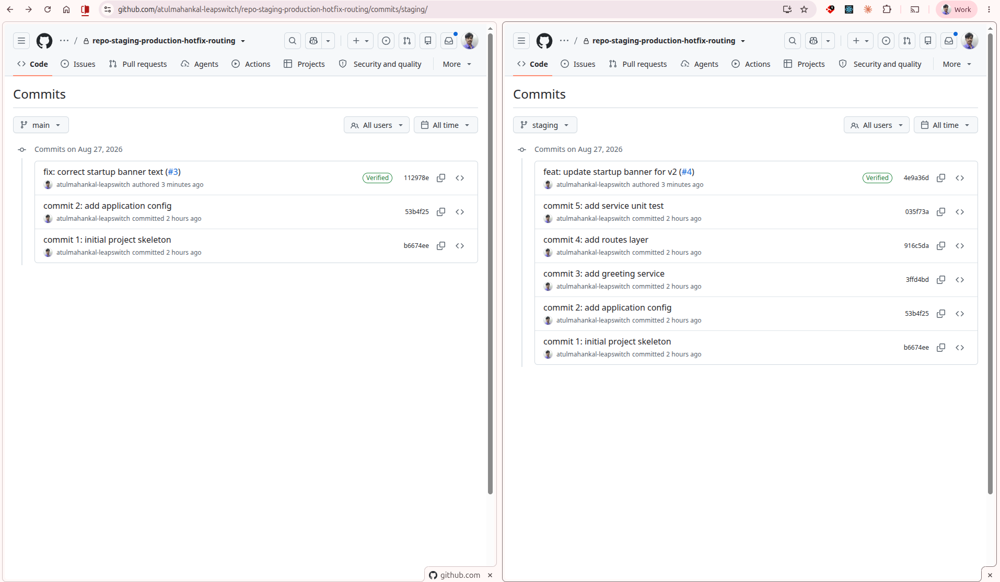
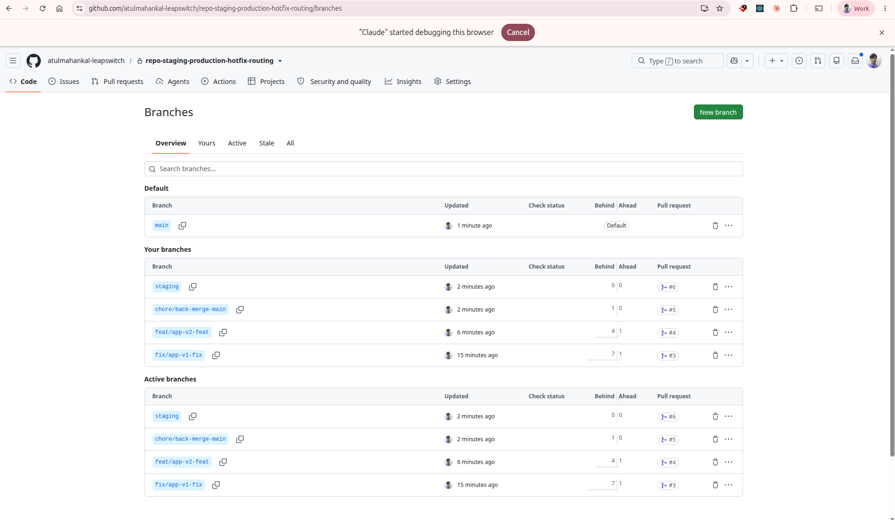
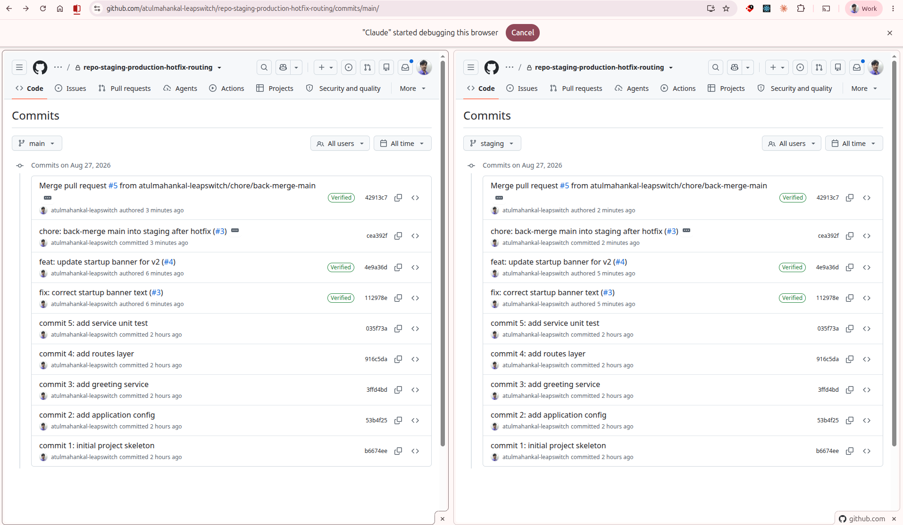

# Staging → Production Workflow, with Hotfix Routing

A worked, reproducible walkthrough of the `development → staging → production` branching
model, including the case that actually breaks it: **a production hotfix landing on `main`
while `staging` still holds unshipped work.**

Every command below was executed against this repository, and every number shown is real
output. The four screenshots are of this repo's GitHub UI at the two states that matter.

---

## Contents

- [The one rule](#the-one-rule)
- [Branch model](#branch-model)
- [How to count what is pending](#how-to-count-what-is-pending)
- [Stage 0 — Baseline](#stage-0--baseline)
- [Stage 1 — Hotfix onto `main` (PR #3)](#stage-1--hotfix-onto-main-pr-3)
- [Stage 2 — Feature onto `staging` (PR #4)](#stage-2--feature-onto-staging-pr-4)
- [Stage 3 — Diverged](#stage-3--diverged)
- [Stage 4 — Back-merge `main` → `staging` (PR #5)](#stage-4--back-merge-main--staging-pr-5)
- [Stage 5 — Promote `staging` → `main` (PR #6)](#stage-5--promote-staging--main-pr-6)
- [Merge-button reference](#merge-button-reference)
- [Local push vs. GitHub merge](#local-push-vs-github-merge)
- [Enforcing it in CI](#enforcing-it-in-ci)
- [Full command transcript](#full-command-transcript)

---

## The one rule

> **`main` must always be an *ancestor* of `staging`.**

If that holds, `staging` is by definition either **equal to** `main` (`0 | 0`) or **N ahead**
of it (`0 | N`). It can never be "diverged", and promotion is always a clean fast-forward.

Everything in this document is just machinery for keeping that statement true.

```bash
git merge-base --is-ancestor origin/main origin/staging \
  && echo "OK"  \
  || echo "DIVERGED — back-merge before promoting"
```

---

## Branch model

| Branch | Deploys to | Receives |
|---|---|---|
| `main` | production server | fast-forward promotions from `staging`; emergency hotfix PRs |
| `staging` | testing / staging server | squash-merged `feat/*` and `bugfix/*` PRs; back-merge PRs from `main` |
| `feat/*`, `fix/*` | — | your actual work |

Nothing is ever committed directly to `main` or `staging`. Both are moved only by a merged
PR or by a fast-forward.



> Mermaid's `gitGraph` draws the final promotion as a merge; in this repository it is a
> **fast-forward**, so `main` and `staging` end up on the same commit rather than joined by a
> new one. See [Stage 5](#stage-5--promote-staging--main-pr-6).

---

## How to count what is pending

```bash
git fetch origin

# how many staging commits are not yet on main
git rev-list --count origin/main..origin/staging

# BOTH sides at once — this is the one to use as a gate
git rev-list --left-right --count origin/main...origin/staging
#   left  = commits only on main     (must be 0 to promote)
#   right = commits only on staging  (the work being promoted)
```

Note the **three dots** in the second command. Two dots gives one direction; three dots gives
the symmetric difference, which is what tells you about divergence.

To see them rather than count them:

```bash
git log --oneline origin/main..origin/staging
```

The same two numbers appear on GitHub's **Branches** page as the `Behind | Ahead` columns.

---

## Stage 0 — Baseline

`main` at two commits, `staging` three ahead of it.

```bash
git switch -c staging main
# ... work ...
git push -u origin main staging
```

```
  c1 ─ c2                              ← main (production)
        └── c3 ─ c4 ─ c5               ← staging (testing)

  left | right  =  0 | 3     main is an ancestor ✓   promotion would be a clean FF
```

---

## Stage 1 — Hotfix onto `main` (PR #3)

A defect is found in production. `staging` holds three unshipped commits, so the normal
promotion path would ship them alongside the fix. This is the one sanctioned bypass.

**Branch off `main`, never off `staging`.** A branch cut from `staging` already *contains*
c3/c4/c5 — merging it into `main` drags them to production, which is exactly what you are
trying to avoid.

```bash
git switch -c fix/app-v1-fix origin/main     # ← origin/main, not staging
sed -i '2s/.*/    print("app v1-fix")/' app/app.py
git commit -am "fix: correct startup banner text"
git push -u origin fix/app-v1-fix

gh pr create --base main --head fix/app-v1-fix \
  --title "fix: correct startup banner text" --body "..."
gh pr merge 3 --squash
```

Result: `112978e fix: correct startup banner text (#3)` on `main`.

> Verify the fix by deploying **the hotfix branch itself** to the testing server. The
> `staging` *branch* is never touched, so its unshipped work stays unshipped while you test.

---

## Stage 2 — Feature onto `staging` (PR #4)

Meanwhile, ordinary feature work continues — and deliberately touches **the same line of the
same file**, so the reconcile below is the hard case, not the easy one.

```bash
git switch -c feat/app-v2-feat origin/staging
sed -i '2s/.*/    print("app v2-feat")/' app/app.py
git commit -am "feat: update startup banner for v2"
git push -u origin feat/app-v2-feat

gh pr create --base staging --head feat/app-v2-feat \
  --title "feat: update startup banner for v2" --body "..."
gh pr merge 4 --squash
```

Result: `4e9a36d feat: update startup banner for v2 (#4)` on `staging`.

---

## Stage 3 — Diverged

Both branches have now moved independently. This is the state the whole document exists to
resolve.

```bash
git rev-list --left-right --count origin/main...origin/staging
# 1	4

git merge-base --is-ancestor origin/main origin/staging || echo DIVERGED
# DIVERGED
```

```
                            ┌── 112978e  fix (#3)        ← main (production)
  c1 ─ c2 ──────────────────┤
        └── c3 ─ c4 ─ c5 ─ 4e9a36d  feat (#4)           ← staging

  left | right  =  1 | 4     main is NOT an ancestor ✗   FF promotion refused
```

`git merge --ff-only origin/staging` will now refuse, because `main` carries a commit
`staging` has never seen.

GitHub's Branches page shows the same thing as `Behind 1 | Ahead 4`:



And the two commit lists have visibly parted ways — `main` has the fix, `staging` has the
feature, neither has the other:



Both tip commits show `(#N)` in the subject and a green **Verified** badge, because both were
merged through GitHub's button rather than pushed from a laptop — see
[Local push vs. GitHub merge](#local-push-vs-github-merge).

---

## Stage 4 — Back-merge `main` → `staging` (PR #5)

The missing arrow. Bring production's commit *down* into staging so `main` becomes an
ancestor again.

Because both sides edited the same line, this conflicts — and resolving it is a real
decision, not a mechanical merge. Someone must say which text ships next. Here the feature
supersedes the hotfix wording, and the hotfix's *intent* is re-checked against the new string.

```bash
git switch -c chore/back-merge-main origin/staging
git merge origin/main -m "chore: back-merge main into staging after hotfix (#3)"
# CONFLICT (content): Merge conflict in app/app.py
```

```
def main():
<<<<<<< HEAD
    print("app v2-feat")          ← staging
=======
    print("app v1-fix")           ← origin/main
>>>>>>> origin/main
```

```bash
# resolve — keep staging's line
git add app/app.py
git commit --no-edit
git push -u origin chore/back-merge-main

gh pr create --base staging --head chore/back-merge-main \
  --title "chore: back-merge main into staging after hotfix (#3)" --body "..."
gh pr merge 5 --merge          # ← MERGE COMMIT, NOT SQUASH
```

### Why `--merge` and not `--squash`

This is the single most important line in the document.

The merge commit `cea392f` has **two parents** — `4e9a36d` (staging) and `112978e` (main):

```bash
git log -1 --format='parents: %p' cea392f
# parents: 4e9a36d 112978e
```

That second parent *is* the ancestry link. A squash merge flattens the branch into one new
commit with a single parent, discarding it. `main` would still not be an ancestor, and you
would have gone from `1 | 4` to `1 | 7` — **worse than before, while appearing to have fixed
it.**

```
  ✗ squash:   staging ─ S            S has one parent. main still unreachable. 1 | 7
  ✓ merge:    staging ─ M            M has two parents. main reachable.        0 | 6
                        │ ╲
                        │  └── main
```

Result:

```bash
git rev-list --left-right --count origin/main...origin/staging
# 0	6
git merge-base --is-ancestor origin/main origin/staging && echo "FF unblocked"
# FF unblocked
```

---

## Stage 5 — Promote `staging` → `main` (PR #6)

Pre-merge gate: the left number must be `0`. It is.

```bash
gh pr create --base main --head staging \
  --title "release: promote staging to production" --body "..."

git switch main
git merge --ff-only origin/staging
git push origin main
```

GitHub sees the tip land on `main` and marks PR #6 as **Merged** automatically.

### Why the promotion is not done with a merge button

**No GitHub merge button can produce a true fast-forward.** Every option creates a new commit
on `main`, which leaves `main` one ahead of `staging` — the Branches page would read `1 | 0`,
not `0 | 0`.

| Button | Result on the Branches page |
|---|---|
| Create a merge commit | `1 \| 0` — main gains a merge commit staging lacks |
| Squash and merge | `1 \| 0` — main gains a new squashed commit |
| Rebase and merge | `1 \| 0` — main gains rewritten commits with new SHAs |
| `git merge --ff-only` | **`0 \| 0`** — both branches point at the same commit |

`0 | 0` requires the two branches to be **literally the same commit**, and only a
fast-forward does that.

```bash
git rev-parse origin/main origin/staging
# 42913c7...  42913c7...   ← identical
git rev-list --left-right --count origin/main...origin/staging
# 0	0
```

```
  c1 ─ c2 ─┬─ c3 ─ c4 ─ c5 ─ 4e9a36d ─┬─ 42913c7   ← main AND staging
           └────────── 112978e ───────┘

  left | right  =  0 | 0     reconciled ✓
```

The Verified badge survives the fast-forward: `main`'s tip is GitHub's own merge commit from
PR #5, so `git log -1 --format=%G?` still reports `E`.





At this point production gets deployed and the release tagged:

```bash
git tag -a "v$(date +%Y.%m.%d)" -m "release"
git push origin --tags
gh release create "v$(date +%Y.%m.%d)" --generate-notes
```

---

## Merge-button reference

Which button to use, and why, at each merge in this flow:

| Merge | Button | Reason |
|---|---|---|
| `feat/*` → `staging` | **Squash** | one clean commit per feature; keeps staging's log readable |
| `fix/*` → `main` (single commit) | **Squash** | linear main, plus `(#N)` and Verified |
| `fix/*` → `main` (multi-commit hotfix) | `git merge --ff-only` | squash would collapse a deliberate per-app commit split |
| back-merge `main` → `staging` | **Merge commit** | the second parent is the ancestry link — squash destroys it |
| promote `staging` → `main` | `git merge --ff-only` | only a fast-forward yields `0 \| 0` |

---

## Local push vs. GitHub merge

Two cosmetic-looking differences that confuse people, both with the same cause: **who
authored the commit.**

| | `gh pr merge` / merge button | local commit + `git push` |
|---|---|---|
| `(#N)` in the subject | yes — GitHub writes it | no — your commit message is used verbatim |
| **Verified** badge | yes — GitHub signs with its web-flow key | only if you sign locally |
| PR marked Merged | yes | yes, inferred once the commit appears on the base branch |
| Head branch auto-deleted | with `--delete-branch` / repo setting | no |

```bash
git log origin/main -1 --format='%G?'
# E  = signed, signing key not in the local keyring (GitHub's web-flow key)
# N  = unsigned
```

The `(#N)` is worth having for a second reason: it lives in the **commit message**, so a
rebase copies it verbatim. The backlink survives history rewrites even though the SHA does
not.

To get both on a locally fast-forwarded commit:

```bash
git commit -m "fix: correct startup banner text (#1)"   # write the number yourself
git config commit.gpgsign true                          # sign locally
```

### What a rewrite does to merged PRs

PRs #1 and #2 in this repo still read **Merged**, but the commits they recorded were removed
from every branch by a later `--force-with-lease` push. Opening either shows:

> This commit does not belong to any branch on this repository.

The PR page still resolves — GitHub retains the object under `refs/pull/N/head` — but the
commit is an orphan. This is exactly what **rebasing `staging`** would do to every feature PR
already merged into it, and it is the main argument for choosing the merge route over the
rebase route when reconciling.

---

## Enforcing it in CI

Make the rule mechanical instead of remembered. Run this on every `staging` PR and on the
promotion job:

```yaml
- name: main must be an ancestor of staging
  run: |
    git fetch origin main staging --depth=100
    git merge-base --is-ancestor origin/main origin/staging || {
      echo "::error::main is not an ancestor of staging — back-merge main into staging first"
      exit 1
    }
```

Two repo settings worth turning on alongside it:

- **Settings → General → Automatically delete head branches** — otherwise merged `feat/*` and
  `fix/*` branches pile up.
- **Settings → General → Default to PR title for squash merge commits** — this is what puts
  `(#N)` in the subject.

And one habit: open the back-merge PR **as part of the release checklist**, right next to
tagging. Divergence introduced by a hotfix should not survive the day.

---

## Full command transcript

Everything above, in order, with nothing omitted.

```bash
# ── Stage 0 — baseline ────────────────────────────────────────────────────────
git switch -c staging main
git push -u origin main staging

# ── Stage 1 — hotfix onto main ────────────────────────────────────────────────
git switch -c fix/app-v1-fix origin/main
sed -i '2s/.*/    print("app v1-fix")/' app/app.py
git commit -am "fix: correct startup banner text"
git push -u origin fix/app-v1-fix
gh pr create --base main --head fix/app-v1-fix --title "fix: correct startup banner text" --body "..."
gh pr merge 3 --squash

# ── Stage 2 — feature onto staging ────────────────────────────────────────────
git switch -c feat/app-v2-feat origin/staging
sed -i '2s/.*/    print("app v2-feat")/' app/app.py
git commit -am "feat: update startup banner for v2"
git push -u origin feat/app-v2-feat
gh pr create --base staging --head feat/app-v2-feat --title "feat: update startup banner for v2" --body "..."
gh pr merge 4 --squash

# ── Stage 3 — observe the divergence ──────────────────────────────────────────
git fetch -p origin
git rev-list --left-right --count origin/main...origin/staging     # 1  4
git merge-base --is-ancestor origin/main origin/staging            # non-zero exit

# ── Stage 4 — back-merge main into staging ────────────────────────────────────
git switch -c chore/back-merge-main origin/staging
git merge origin/main -m "chore: back-merge main into staging after hotfix (#3)"
# resolve app/app.py by hand, keeping staging's line
git add app/app.py && git commit --no-edit
git push -u origin chore/back-merge-main
gh pr create --base staging --head chore/back-merge-main --title "chore: back-merge main into staging after hotfix (#3)" --body "..."
gh pr merge 5 --merge                                              # NOT --squash
git fetch -p origin
git rev-list --left-right --count origin/main...origin/staging     # 0  6

# ── Stage 5 — promote staging to main ─────────────────────────────────────────
gh pr create --base main --head staging --title "release: promote staging to production" --body "..."
git switch main
git merge --ff-only origin/staging
git push origin main
git fetch -p origin
git rev-list --left-right --count origin/main...origin/staging     # 0  0

# ── release ───────────────────────────────────────────────────────────────────
git tag -a "v$(date +%Y.%m.%d)" -m "release"
git push origin --tags
```

---

## Pull requests in this repository

| PR | Head → Base | Merge style | Result |
|---|---|---|---|
| [#3](../../pull/3) | `fix/app-v1-fix` → `main` | squash | `112978e fix: correct startup banner text (#3)` |
| [#4](../../pull/4) | `feat/app-v2-feat` → `staging` | squash | `4e9a36d feat: update startup banner for v2 (#4)` |
| [#5](../../pull/5) | `chore/back-merge-main` → `staging` | **merge commit** | `42913c7` — two parents, restores ancestry |
| [#6](../../pull/6) | `staging` → `main` | `--ff-only` | `42913c7` — both branches identical, `0 \| 0` |

PRs #1 and #2 were an earlier run of the same scenario, reset away with `--force-with-lease`.
They are deliberately left in place as the orphaned-commit example described above.
